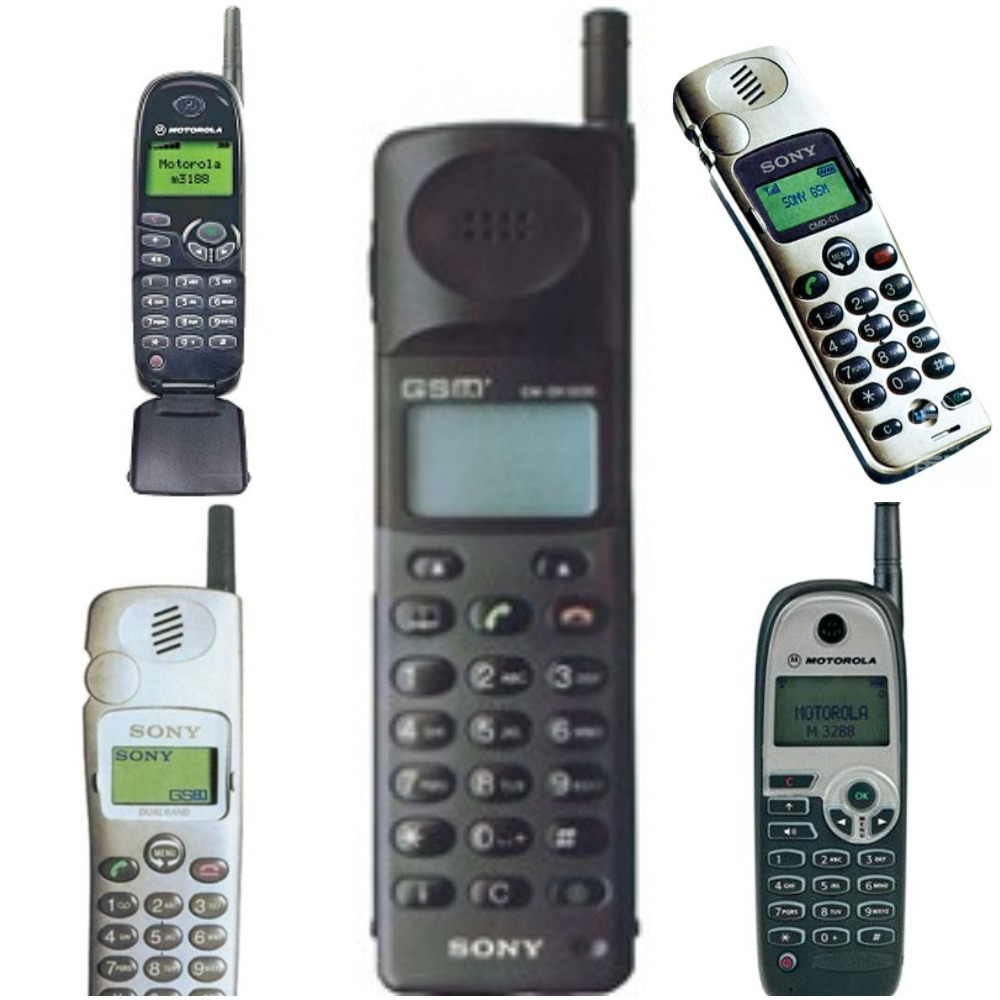

<div align="center">

</div>

<h1 dir="RTL"> 
تمرین سری دوم: تلفن همراه شناسی!
</h1>

> <p dir="RTL"> 
 با استفاده از داده های گوشی های همراه به سوالات زیر پاسخ دهید. 
برای رسم نمودار از پکیج 
ggplot2
استفاده کنید.
</p>

***

<p dir="RTL"> 
پیش از شروع به تحلیل، 
پکیج های مورد نیاز را صدا زده و داده مربوط به تلفن های همراه را وارد میکنیم:
</p>
```{r, eval=FALSE}
library(readr)
library(dplyr)
library(ggplot2)

mobile=read_csv("/Users/Kayhan/Desktop/01-mobile_data.csv")
```
```{r include=FALSE, cache=FALSE}
library(readr)
library(dplyr)
library(ggplot2)

mobile=read_csv("/Users/Kayhan/Desktop/01-mobile_data.csv")
```

***
<p dir="RTL">
۱. کدام شرکت بیشترین تعداد گوشی را تولید کرده است؟
نمودار ستونی ۲۰ شرکت برتر بر حسب تعداد گوشی تولید کرده را رسم کنید.
</p>

<h4 dir="RTL">
پاسخ:
</h4>
<p dir="RTL"> 
ابتدا تلفن های همراه را برحسب کمپانی سازنده گروه بندی می کنیم و تعداد عناطر موجود در هر گروه را می شماریم:
</p>
```{r}
mobile %>%
  group_by(company) %>% 
  summarise(count=n()) -> numByComp
```
<p dir="RTL"> 
سپس این داده ها را برحسب تعداد اعضای هر گروه مرتب میکنیم و ۲۰ خانه ی اول آن را جدا میکنیم و روی نمودار ستونی نمایش می دهیم:
</p>
```{r}
numByComp=numByComp[with(numByComp, order(-count)),]
numByComp=numByComp[1:20,]
numByComp=numByComp[with(numByComp, order(count)),]
numByComp$company <- factor(numByComp$company, levels=numByComp$company[1:20])
plot = ggplot(numByComp, aes(company,count))
plot + geom_bar(stat = "identity", color="black", fill="blue") + 
       coord_flip() + xlab("Company") + ylab("Count")
```
<p dir="RTL"> 
در نهایت هم متغیرهای اضافی را پاک می کنیم:
</p>
```{r}
rm(plot, numByComp)
```

***
<p dir="RTL">
۲. نمودار زمانی طول عرض  ضخامت و کیفیت دوربین گوشی ها را بکشید
 و به نمودار هر یک مدل خطی اضافه کنید.
</p>
<h4 dir="RTL">
پاسخ:
</h4>
<p dir="RTL"> 
داده ها را بر اساس سال انتشار گروه بندی می کنیم و برای هر گروه، میانگین طول و عرض و ضخامت و کیفیت دوربین آن را محاسبه می کنیم:
</p>
```{r}
mobile %>%
  group_by(year) %>% 
  summarise(length=mean(dim_length, na.rm = TRUE),
            breadth=mean(dim_breadth, na.rm = TRUE), 
            thikness=mean(dim_thickness, na.rm = TRUE),
            camera=mean(cam_px, na.rm = TRUE)) -> evolution

```
<p dir="RTL"> 
حالا میتوانیم نمودارهای خواسته شده را رسم کنیم. نمودار متوسط طول گوشی ها برحسب سال عرضه به بازار:
</p>
```{r, warning=FALSE}
plot = ggplot(evolution, aes(year, length))
plot + geom_point() + geom_smooth(method = "lm") + 
       xlab("Year") + ylab("Length (mm)")
```

<p dir="RTL"> 
نمودار متوسط عرض گوشی ها برحسب سال عرضه:
</p>
```{r, warning=FALSE}
plot = ggplot(evolution, aes(year, breadth))
plot + geom_point() + geom_smooth(method = "lm") +
       xlab("Year") + ylab("Breadth (mm)")
```

<p dir="RTL"> 
نمودار متوسط ضخامت گوشی ها برحسب سال عرضه:
</p>
```{r, warning=FALSE}
plot = ggplot(evolution, aes(year, thikness))
plot + geom_point() + geom_smooth(method = "lm") +
       xlab("Year") + ylab("Thikness (mm)")
```

<p dir="RTL"> 
نمودار متوسط کیفیت دوربین گوشی ها برحسب سال عرضه:
</p>
```{r, warning=FALSE}
plot = ggplot(evolution, aes(year, camera))
plot + geom_point() + geom_smooth(method = "lm") +
       xlab("Year") + ylab("Camera (Mega-Pixel)")
```

<p dir="RTL"> 
در نهایت هم متغیرهای اضافی را پاک می کنیم:
</p>
```{r}
rm(evolution, plot)
```

***

<p dir="RTL">
۳. نمودار ستونی متوسط قیمت گوشی بر حسب تعداد سیم کارت و دسترسی به 
LTE
را رسم نمایید.
</p>

<h4 dir="RTL">
پاسخ:
</h4>

```{r, warning=FALSE}
mobilePrices = mobile[which(mobile$price<2000),]
mobilePrices %>%
  group_by(sim_no, LTE) %>%
  summarise(price=mean(price, na.rm = TRUE)) -> mobilePrices
plot = ggplot(mobilePrices, aes(x=sim_no, y=price))
plot + geom_bar(stat = "identity", aes(fill=LTE)) + xlab("Number of Sim Cards") + ylab("Average Price (Euro)")

```

***

<p dir="RTL">
۴. نمودار جعبه ایی ضحامت گوشی هایی که در سال ۲۰۱۷ معرفی شده اند را برحسب اینکه کمیت جک هدفون رسم نمایید
</p>

<h4 dir="RTL">
پاسخ:
</h4>

```{r, warning=FALSE}
mobileYear = mobile[which(mobile$year==2017),]
plot = ggplot(mobileYear, aes(audio_jack,dim_thickness))
plot + geom_boxplot() + xlab("Audio Jack") + ylab("Thickness")

rm(mobileYear, plot)
```

***

<p dir="RTL">
۵. مفهوم 
ppi 
را در گوشی های موبایل محاسبه و هیستوگرام آن را رسم نمایید.
همچنین نمودار سالانه متوسط این کمیت را بکشید.
کدام گوشی بیشترین
ppi
را دارد؟
</p>

<h4 dir="RTL">
پاسخ:
</h4>

<p dir="RTL">
ابتدا برای هر گوشی، چگالی پیکسل هارا در راستای طول و در راستای عرض حساب کرده و میانگین این دو کمیت را حساب کرده و به عنوان 
ppi 
برای گوشی در نظر میگیریم:
</p>

```{r, warning=FALSE}
x=sqrt((mobile$display_size^2)/(mobile$aspect_row^2 + mobile$aspect_col^2))
ppi1=mobile$px_col/(mobile$aspect_row*x)
ppi2=mobile$px_row/(mobile$aspect_col*x)
ppi=(ppi1+ppi2)/2
ppi=round(ppi)
mobile$ppi=ppi
rm(ppi,ppi1,ppi2,x)
```

<p dir="RTL">
سپس می توانیم هیستوگرام 
ppi 
گوشی ها را نگاه کنیم:
</p> 
```{r, warning=FALSE}
plot = ggplot(mobile, aes(ppi))
plot + geom_histogram(color="black",fill="blue",binwidth = 15) +
       xlab("Pixel Density (ppi)") + ylab("Count")
```

<p dir="RTL">
همچنین نمودار سالانه ی متوسط این کمیت هم به این صورت محاسبه می شود:
</p> 

```{r, warning=FALSE}
mobile %>%
  group_by(year) %>% 
  summarise(ppi=mean(ppi, na.rm = TRUE)) -> tmp
plot = ggplot(tmp, aes(year,ppi))
plot + geom_point(color="blue", alpha=0.8) +
       geom_line(color="blue", linetype = "dashed", alpha=0.3)
```

<p dir="RTL">
همانطور که مشخص است، چگالی پیکسل ها در گوشی های همراه سال به سال در حال افزایش است. در بین گوشی های موجود در بازار، بیشترین 
ppi 
موجود را به این صورت محاسبه می کنیم:
</p> 

```{r, warning=FALSE}
maxPPI=mobile[which(mobile$ppi==max(mobile$ppi, na.rm = TRUE)),]
cat(maxPPI$company,",", maxPPI$device ,", Pixel Density =", maxPPI$ppi," ppi")
```

<p dir="RTL">
همانطور که مشخص است، بیشترین چکالی پیکسل مربوط به گوشی 
Sony Xperia XZ Premium 
است که 
ppi 
این گوشی 
944 
می باشد.
</p> 

<p dir="RTL"> 
در نهایت هم متغیرهای اضافی را پاک می کنیم:
</p>

```{r, warning=FALSE}
rm(maxPPI, plot, tmp)
```

***

<p dir="RTL">
۶. در گذشته به بعضی از مدل های گوشی نوکیا 
**گوشکوب**
گفته می شد. سعی کنید برای این مفهوم کمیتی مناسب تعریف کنید .
 ده گوشکوب برتر را پیدا کرده و نمودار گوشکوبیت آن را رسم نمایید.
</p>

<h4 dir="RTL">
پاسخ:
</h4>

<p dir="RTL">
از آنجا که این سوال، یک سوال کیفی است، سلیقه ی افراد در کمی کردن این کمیت دخیل است و نمی توان جواب یکتایی به سوال داد. اما از نظر نگارنده، یک 
**گوشکوب** 
باید ضخیم باشد، طول زیادی داشته باشد و تعداد پیکسل های صفحه نمایش آن کم باشد. یعنی برای هر موبایل، میزان گوشکوب بودن را می توان به صورت زیر تعریف کرد: 
</p> 
$Masherness=\frac{Length*Thikness}{Pixels}$
<p dir="RTL">
اگر این کمیت را برای همه ی گوشی ها تعریف کنیم و سپس گوشکوبیت همه ی گوشی ها را به بالاترین گوشکوبیت موجود تقسیم کنیم، خواهیم داشت:
</p> 
```{r, warning=FALSE}
masherness = (mobile$dim_thickness*mobile$dim_length)/(mobile$px_col * mobile$px_row)
maxMasheness=max(masherness, na.rm = TRUE)
masherness = masherness/maxMasheness
mobile$masherness=masherness
```
<p dir="RTL">
می توان ۱۰ گوشکوب برتر را به این صورت مشاهده کرد:
</p> 
```{r, warning=FALSE}
masherMobiles = mobile[with(mobile, order(-masherness)),]
masherMobiles = masherMobiles[1:10,]
masherMobiles = masherMobiles[with(masherMobiles, order(masherness)),]
masherMobiles$compdev = paste(masherMobiles$company,masherMobiles$device, sep = ", ")
masherMobiles$compdev <- factor(masherMobiles$compdev, levels = masherMobiles$compdev[1:10])

plot = ggplot(masherMobiles, aes(compdev,masherness))
plot + geom_bar(stat = "identity", color="black", fill="blue") + coord_flip() +
       xlab("Device") + ylab("Masherness!")
```
<p dir="RTL">
عکس یادگاری برترین گوشکوب های تاریخ(!):
</p> 

<div align="center">

</div>


***

<p dir="RTL">
۷. آیا تلفن همراهی وجود دارد که در آب غرق نشود؟
اگر جواب بله هست تمام گوشی های که این خاصیت را دارند بیابید.
با کشیدن یک نمودار به این سوال پاسخ دهید.
</p>

<h4 dir="RTL">
پاسخ:
</h4>

<p dir="RTL">
اگر نمودار پراکنش چگالی گوشی ها بر حسب سال را رسم کنیم، و چگالی آب را هم با یک خط نشان دهیم، نقاط زیر خط مربوط به گوشی هایی با چگالی کمتر از چگالی آب است:
</p>
```{r, warning=FALSE}
density=1000*mobile$weight/(mobile$dim_breadth*mobile$dim_length*mobile$dim_thickness)
mobile$density = density

plot = ggplot(mobile, aes(x=year,y=density))
cutoff <- data.frame(x=c(-Inf, Inf), y=1, cutoff=factor(1))
plot + geom_point(stat = "identity", color="blue", alpha=0.5) +
       geom_line(aes(x, y), cutoff)
```

<p dir="RTL">
تعداد این گوشی ها زیاد است. برای به دست آوردن لیست همه ی آن ها می توانیم از کد زیر استفاده کنیم:
</p>
```{r, warning=FALSE}
mobile[which(mobile$density<1),] %>%
  arrange(density) ->lightMobiles
```
<p dir="RTL">
ده تا گوشی اول این لیست عبارتند از:
</p>
```{r, warning=FALSE}
print (lightMobiles[1:10,c(1,2,39)])
```

<p dir="RTL"> 
در نهایت هم متغیرهای اضافی را پاک می کنیم:
</p>

```{r, warning=FALSE}
rm(cutoff,lightMobiles,plot,density)
```

***

<p dir="RTL">
۸. نمودار پراکنش حجم ذخیره سازی باطری و وزن را رسم نمایید.
میزان همبستگی بین این دو کمیت را محاسبه کنید.
</p>

<h4 dir="RTL">
پاسخ:
</h4>

<p dir="RTL">
نمودار پراکنش حجم ذخیره سازی باتری بر حسب وزن آن به این صورت است:
</p>

```{r, warning=FALSE}
plot = ggplot(mobile, aes(x=weight, y=battery_mah))
plot + geom_point(color="blue", alpha=0.5) +
       geom_smooth(color="black") +
       xlab("Weight (gram)") + ylab("Battery (mAh)")
```

<p dir="RTL">
همبستگی بین این دو کمیت هم به این صورت محاسبه می شود:
</p>
```{r, warning=FALSE}
myMobiles = mobile[which(!is.na(mobile$weight) & !is.na(mobile$battery_mah)),]
cor(myMobiles$weight, myMobiles$battery_mah, method = "pearson")
```


***

<p dir="RTL">
۹. قیمت پرچمداران یک برند خاص مثلا سامسونگ را بیابید و نمودار قیمت زمان و نام مدل را رسم نمایید.
</p>

<h4 dir="RTL">
پاسخ:
</h4>
<p dir="RTL">
پرچمدار هر کمپانی را دستگاهی در هر سال که بیشترین قیمت را بین محصولات آن کمپانی دارد در نطر میگیریم. برای مثال میخواهیم پرچمداران کمپانی اپل را بررسی کنیم:
</p>
```{r, warning=FALSE}
devices = mobile[which(mobile$company=="Apple" & mobile$sim_no>0 & !is.na(mobile$year)),]
devices %>%
  group_by(year) %>% 
  slice(which.max(price)) -> parchamdaran
```
<p dir="RTL">
حالا میتوانیم نمودار قیمت-زمان پرچمداران اپل را بررسی کنیم:
</p>
```{r, warning=FALSE}
plot = ggplot(parchamdaran, aes(x=year, y=price, color=device))
plot + geom_point(color="blue") +
       geom_line(linetype="dashed", color="blue", alpha=0.3) +
       xlab("Year") + ylab("Price")
```
<p dir="RTL">
همچنین می توانیم نام پرچمداران اپل را هم در طی زمان مشاهده کنیم:
</p>
```{r, warning=FALSE}
parchamdaran %>%
  arrange(year) -> parchamdaran

parchamdaran$device <- factor(parchamdaran$device, levels = parchamdaran$device)

plot = ggplot(parchamdaran, aes(x=year, y=device, color=price))
plot + geom_point(stat = "identity") + xlab("Year") + ylab("Device")
```
<p dir="RTL"> 
در نهایت هم متغیرهای اضافی را پاک می کنیم:
</p>

```{r, warning=FALSE}
rm(plot,parchamdaran,devices)
```

***

<p dir="RTL">
۱۰. سه نمودار جالب رسم کنید و توضیح دهید چرا از نظر شما جالب است؟
</p>

<h4 dir="RTL">
پاسخ:
</h4>

<p dir="RTL">
نمودار اول، میانگین گوشکوبیت تلفن های همراه در طول زمان است:
</p>

```{r, warning=FALSE}
mobile %>%
  group_by(year) %>% 
  summarise(masherness=mean(masherness, na.rm = TRUE)) -> tmp

plot = ggplot(tmp, aes(year,masherness))
plot + geom_point(color="blue", alpha=0.8) + 
       geom_line(color="blue", linetype = "dashed", alpha=0.3)
```

<p dir="RTL">
همانطور که مشخص است، گوشکوبیت گوشی ها در طی زمان رو به کاهش است.
</p>

<p dir="RTL">
نمودار دوم، درصد گوشی های لمسی برحسب زمان است:
</p>
```{r, warning=FALSE}
mobile %>%
  group_by(year) %>% 
  summarise(numberOfMobiles=n(), numberOfTouches=sum(grepl("touchscreen", display_tech)))%>%
  mutate(touchPercentage=100*numberOfTouches/numberOfMobiles)-> tmp
plot = ggplot(tmp, aes(x=year, y=touchPercentage))
plot + geom_point(color="blue") +
       geom_line(color="blue", alpha=0.3, linetype="dashed") +
       xlab("Year") + ylab("Percentage of Touchscreen Displays")
```

<p dir="RTL">
نمودار سوم هم سهم هریک از سیستم عامل های معروف از بازار گوشی ها در طی زمان است:
</p>
```{r, warning=FALSE}
mobile %>%
  group_by(year) %>% 
  summarise(PercentageOfAndroid=100*sum(os_type=="Android", na.rm = TRUE)/n(), 
            PercentageOfIOS = 100*sum(os_type=="iOS", na.rm = TRUE)/n(), 
            PercentageOfBlackBerry = 100*sum(os_type=="BlackBerry", na.rm = TRUE)/n(),
            PercentageOfSymbian = 100*sum(os_type=="Symbian", na.rm = TRUE)/n(),
            PercentageOfWindows = 100*sum(os_type=="Microsoft", na.rm = TRUE)/n()) %>%
  mutate(PercentageOfOthers=100 - (PercentageOfBlackBerry + PercentageOfSymbian + 
                                     PercentageOfAndroid + PercentageOfIOS +
                                     PercentageOfWindows))-> tmp

plot = ggplot(tmp, aes(x=year, color=OS))
plot + 
  
  geom_point(aes(y=PercentageOfAndroid, col="1")) +
  geom_line(aes(y=PercentageOfAndroid, col="1")) +
  
  geom_point(aes(y=PercentageOfIOS, color="2")) +
  geom_line(aes(y=PercentageOfIOS, color="2")) +
  
  geom_point(aes(y=PercentageOfBlackBerry, color="3")) +
  geom_line(aes(y=PercentageOfBlackBerry, color="3")) +
  
  geom_point(aes(y=PercentageOfSymbian, color="4")) +
  geom_line(aes(y=PercentageOfSymbian, color="4")) +
  
  geom_point(aes(y=PercentageOfWindows, color="5")) +
  geom_line(aes(y=PercentageOfWindows, color="5")) +
  
  geom_point(aes(x=year, y=PercentageOfOthers, color="6")) +
  geom_line(aes(x=year, y=PercentageOfOthers, color="6")) + 
  
  xlab("Year") + ylab("Percentage")+
  
  scale_colour_discrete(labels=c("Android", "iOS", "BlackBerry",
                                 "Symbian", "Microsoft", "Others"))
```
<p dir="RTL">
همانطور که مشخص است، پس از سال ۲۰۰۸، سیستم عامل اندروید با سرعت رشد کرده و در سال ۲۰۱۷ بیش از ۹۵ درصد گوشی ها را به خود اختصاص داده است
</p>

